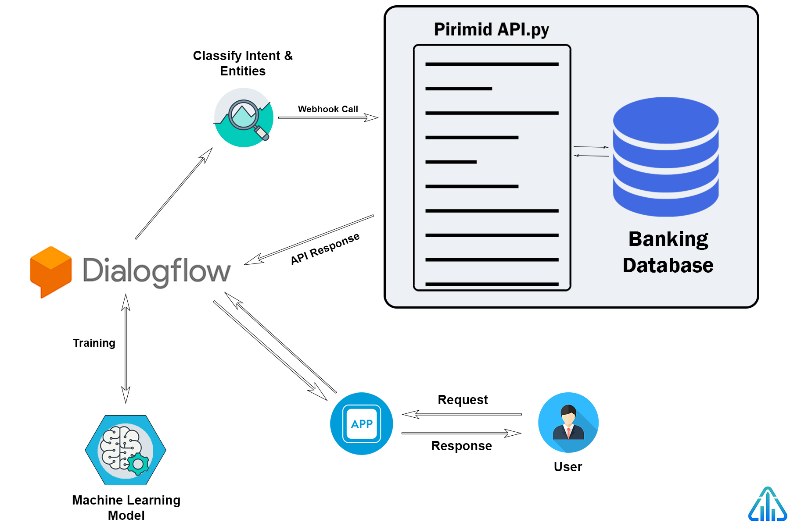

## Dialogflow Chatbot

[Dialogflow](https://dialogflow.com/) is a Google-owned developer of human-computer interaction technologies based on natural language conversations. The company is best known for creating the Assistant, a virtual buddy for Android, iOS, and Windows Phone smartphones that perform tasks and answers users' question in a natural language.

## Python API:

We have created API in Python which could manipulate the data from our own MySQL database and sends it to the Dialogflow chatbot.

When a user sends a message to the chatbot, the chatbot agent identifies which intents, parameters, and entities using it's NLP and Machine Learning models which are trained upon the sets of the example provided by us. Then the Dialogflow agent sends a POST request to our Python API which we have uploaded on Heroku.

Here below let's discuss on how the API workflow goes:

1. As the API receives the POST request, it triggers the [Python API](main.py).
2. After fetching all the JSON objects in the POST request, our API pulls all the parameters, actions and entities to get a better understanding of what the user wants specifically.
3. Using the MySQL libraries, our API is able to manipulate the data in our database which mimics to that of Bank's database.
4. After performing all the actions as per the user's needs, our API collects all the answers and converts it into the [Dialogflow's JSON object](https://dialogflow.com/docs/fulfillment/how-it-works) (Dialogflow only accepts a response in JSON format).

After which Dialogflow shows the response to the user according to the fulfillment response which it gets from our APIs.

For better understanding of how the whole process flow works we have divided the whole process into two parts User Side and Server Side. But before that we have simplified the process and shown it in graphical form below:

  

### User Side

Here the User will be interacting with the chatbot directly. We here for our demo purpose have used Slack by which the user will get bank details. Below are given a few screen shots on how the user will be interact with chatbot:

  

  

  

The Slack bot is directed to Dialogflow's agent. Dialogflow will then classify the user's message into a specific intent and extract the valuable information from it (Entities) such as account type, date, merchant, etc.

### Server Side

A Webhook call will be made to our API where Dialogflow will send JSON object containing all the required information such as intent, entities, action, time, etc.

A POST request will arrive at our Python API where, according the intent and their specific entities, data will be fetched from the bank servers.

The Data from the bank's database will be then sent back to our API where it will converted into Dialogflow's JSON object format and then sent back to Dialogflow.

Dialogflow will then send the response to the Slack bot which we had integrated for our demo purpose.